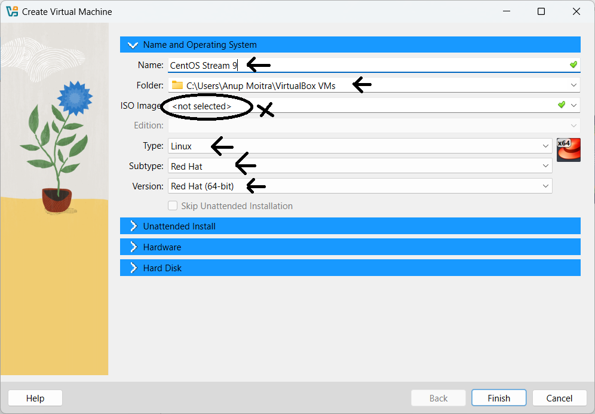
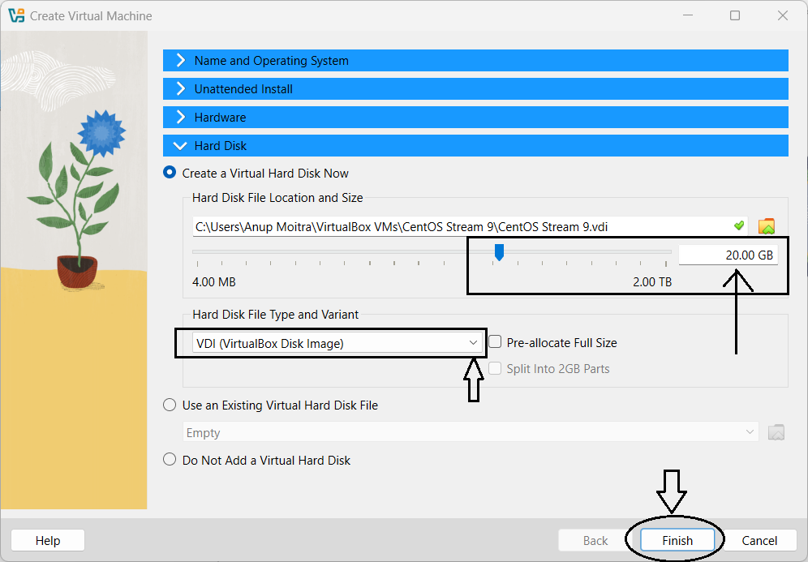

# Module 2: Virtual Lab Setup

## Chapter 2: Creating and Configuring a Virtual Machine

### 📝 Introduction

Setting up a virtual machine (VM) using **VirtualBox** is a crucial step for practicing Linux in a controlled, safe environment. In this chapter, you will learn how to create and configure a VM that will later host **CentOS Stream 9**, preparing you for the next installation steps.

---

### 📚 What Will You Learn?

- How to create a new virtual machine in VirtualBox  
- How to configure hardware settings such as RAM and CPU  
- How to set up storage options, including the virtual hard disk  
- How to configure network settings for proper VM connectivity

---

### 🔧 Step-by-Step Instructions

#### 🚀 1. Launch VirtualBox

- Open **VirtualBox** from your system’s application menu or desktop shortcut.

#### 🖥️ 2. Create a New Virtual Machine

1. Click the **New** button to start the virtual machine creation wizard.  
2. Enter a name for the VM, e.g., **CentOS Stream 9**. This name identifies the VM within VirtualBox.  
3. Select the folder location for VM files. Ensure there is enough disk space available.  
4. Leave the **ISO image** field blank for now; this will be configured during the OS installation chapter.  
5. Select **Linux** as the type and choose **Red Hat (64-bit)** as the version to match CentOS Stream 9.  
6. Skip the **Unattended Installation** option to allow manual setup during OS installation.  
7. Configure hardware:  
   - Allocate at least **2048 MB (2 GB)** RAM. Adjust based on your system capabilities.  
   - Use the default **1 CPU core**, or increase if your system supports it.  
8. Configure storage:  
   - Create a new virtual hard disk or select an existing one.  
   - Choose **VDI (VirtualBox Disk Image)** as the disk type.  
   - Select **dynamically allocated** or **fixed size** depending on preference.  
   - Set the size to at least **20 GB** to accommodate the OS and software.

#### 🌐 3. Configure Network Settings

1. Select the created VM and click **Settings**.  
2. Go to the **Network** tab.  
3. Ensure the network adapter is enabled.  
4. By default, the adapter uses **NAT** for internet access.  
5. For enhanced connectivity, change to **Bridged Adapter** to place the VM on your local network.  
6. Click **OK** to save settings.

---

### 📸 Screenshots

**Figure 1:** VirtualBox Main Window with **New** Button  

**Figure 2:** VM Creation Wizard – Name, Path, OS Type, and Version  

**Figure 3:** VM Creation Wizard – Hardware Configuration  

**Figure 4:** VM Creation Wizard – Hard Disk Configuration  

**Figure 5:** Accessing VM Settings  

**Figure 6:** Network Adapter Configuration – Bridged Adapter  

---

### 🎯 Key Takeaways

- You have successfully created a new VM tailored for Linux installation.  
- Hardware and storage are configured to meet minimum requirements for CentOS Stream 9.  
- Network settings are optimized to provide internet access and potential local network connectivity.  
- This VM is ready for ISO attachment and OS installation in the next chapter.

---

This marks a major step toward building your Linux virtual lab, enabling you to safely explore and master Linux concepts hands-on.

