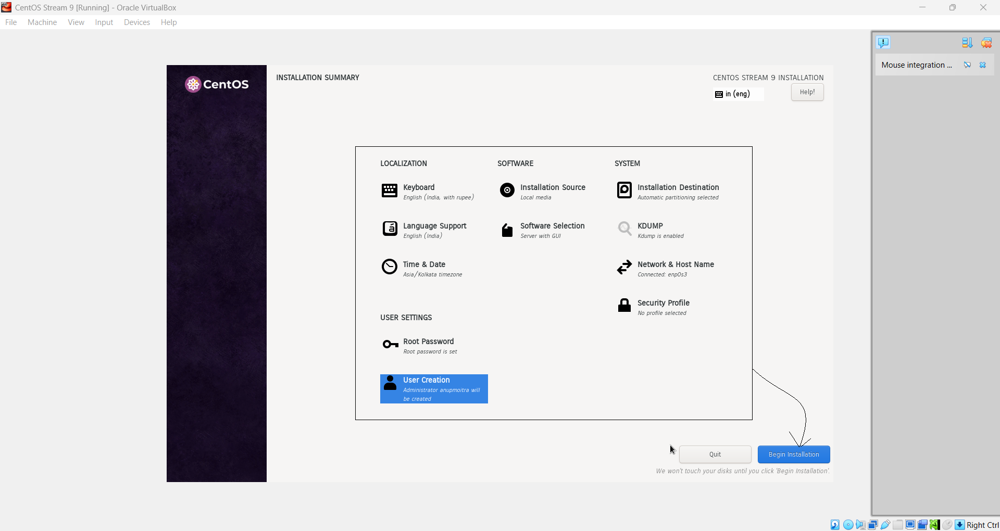

# Module 2: Virtual Lab Setup

## Chapter 3: Download and Install Linux (CentOS Stream 9)

### 📝 Introduction

In this chapter, you’ll set up and install **CentOS Stream 9** on your virtual machine (VM). This process lays the groundwork for hands-on Linux practice and experimentation within your new virtual lab environment.

---

### 📚 What You Will Learn

- How to download the **CentOS Stream 9** ISO image  
- How to attach the ISO file to your VirtualBox VM  
- Step-by-step instructions for installing CentOS Stream 9  
- Tips on key setup choices and best practices during installation

---

### 🚀 Step 1: Download the CentOS Stream 9 ISO Image

1. Open your web browser and visit the [CentOS Download Page](https://www.centos.org/download/).
2. Find the section for **CentOS Stream 9**.
3. Select the correct architecture (e.g., **x86_64**).
4. Click the download link to start downloading the ISO file.

---

### 💿 Step 2: Attach the ISO to the Virtual Machine

1. Open **VirtualBox** and select your VM (e.g., “CentOS Stream 9”).
2. Click **Settings** and go to the **Storage** tab.
3. Under **Controller: IDE**, click the **Empty** optical drive icon.
4. Click **Choose a disk file** and browse to your downloaded CentOS Stream 9 ISO.
5. Select the ISO and click **OK** to attach it.

---

### ⚡ Step 3: Boot from the ISO and Start Installation

1. With the ISO attached, click **Start** in VirtualBox to boot your VM.
2. The CentOS installation menu appears. Use the arrow keys to select **Install CentOS Stream 9** and press **Enter**.

---

### ⚙️ Step 4: Configure Installation Settings

At the **Installation Summary** screen, review and adjust the following:

#### 🗺️ Localization
- **Language and Keyboard Layout:** Select your preferred language and keyboard. Click **Continue**.
- **Date & Time:** Set your time zone (e.g., Asia/Kolkata).
- **Language Support:** Ensure your language is selected.

#### 🖥️ Software
- **Installation Source:** Should default to **Local Media** if the ISO is attached.
- **Software Selection:**  
  - For a graphical experience, select **Server with GUI**.  
  - For a lightweight server, choose **Minimal Install**.

#### 💾 System
- **Installation Destination:** Select the virtual hard disk created earlier. Accept **Automatic Partitioning** or customize if you prefer.
- **KDUMP:** Leave enabled unless you have special requirements.
- **Network & Hostname:**  
  - Ensure the network adapter is enabled.  
  - Optionally, set a hostname (e.g., `centos-vm.local`).

#### 🔐 User Settings
- **Root Password:** Set a strong root password.
- **User Creation:** Create a new admin user. Using a non-root user for daily tasks is best for security.

After confirming all selections, click **Begin Installation**.

---

### ⏳ Step 5: Complete the Installation

1. Wait for the installation process to finish.
2. When prompted, click **Reboot** to restart your VM.
3. **Detach the ISO**: Before rebooting, ensure the ISO is removed from the virtual drive to boot from your new OS.

---

## 🖼️ Screenshots

**Figure 1:** CentOS Download Page  

**Figure 2:** Attach ISO to Virtual Machine  

**Figure 3:** Installation Menu  

**Figure 4:** Installation Summary Screen  

**Figure 5:** CentOS Home Screen  

---

### 🎯 Key Takeaways

- You have downloaded and installed CentOS Stream 9 inside your virtual lab.
- The installation process included key setup choices—software selection, partitioning, user creation, and networking.
- Your VM is now ready for post-installation configuration and first boot into Linux.

---

> In the next chapter, we’ll explore essential post-installation setup tasks and basic Linux commands to get started with CentOS Stream 9.

---
