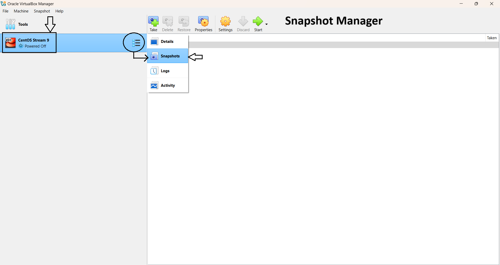
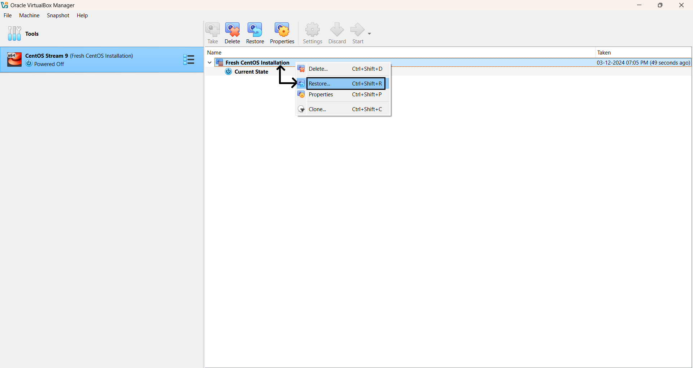
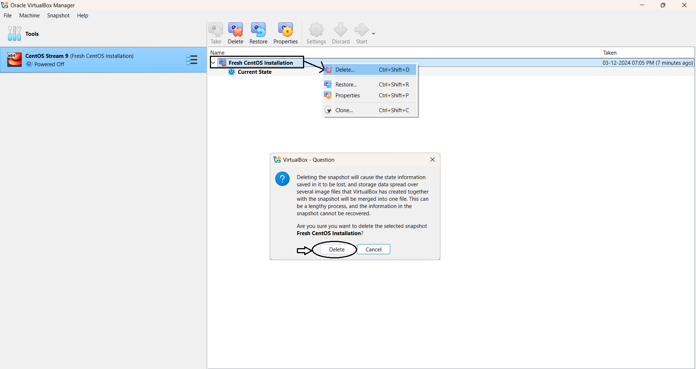

# Module 2: Virtual Lab Setup

## Chapter 4: Taking Snapshots in VirtualBox

### 🖥️ Introduction

In this chapter, we’ll explore the concept of **snapshots** in VirtualBox. Snapshots allow you to save the exact state of your virtual machine (VM) at a specific moment in time—making them invaluable for testing, experimentation, and easy rollback if something goes wrong.

---

### 📚 What You Will Learn

- How to take, restore, and delete snapshots in **VirtualBox**
- When and why to use snapshots during experimentation
- Best practices and cautions for snapshot management

---

### 🔧 Step-by-Step Instructions

#### 1️⃣ Access the Snapshot Manager

- Open **VirtualBox** and select the VM for which you want to manage snapshots.
- Click on the **Snapshots** tab in the right-hand pane.

#### 2️⃣ Take a Snapshot

- Click the **Take Snapshot** button (camera icon), or right-click on the current state and select **Take Snapshot**. 📸
- Enter a **name** and an optional **description** (e.g., *"Pre-Update Configuration"*).
- Click **OK** to save the snapshot.

#### 3️⃣ Restore a Snapshot

- Go to the **Snapshots** tab.
- Right-click on the snapshot you wish to restore and select **Restore**. 🔄
- Confirm the restoration when prompted. Your VM will revert to the exact point you saved.

#### 4️⃣ Delete a Snapshot

- In the **Snapshots** tab, right-click the snapshot you wish to delete and select **Delete Snapshot**. ❌
- Confirm deletion to free up disk space.

---

### 📸 Screenshots

**Figure 1:** Snapshot Manager in VirtualBox  

**Figure 2:** Taking a new snapshot  

**Figure 3:** Restoring a snapshot  

**Figure 4:** Deleting a snapshot  

---

### 🎯 Key Takeaways & Best Practices

- **Snapshots are perfect for short-term recovery points** (such as before system updates or experiments).
- **Do not rely on snapshots for long-term backup**—make full VM backups for critical data and system states.
- Be mindful: **storing many snapshots can quickly eat up disk space** and slow down VM performance.
- Regularly review and clean up unneeded snapshots as your virtual lab evolves.

---

> Snapshots let you experiment and learn without fear—restore your VM as needed and keep moving forward!
