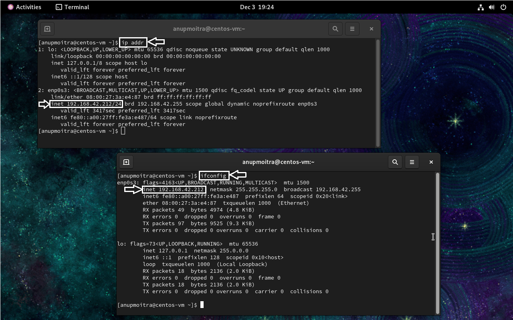
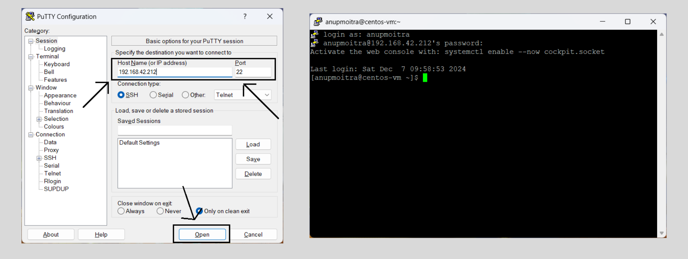

# Module 3: System Access and File Management

## Chapter 3: Accessing a Linux Machine via PuTTY or SSH

### 🖥️ Introduction
In this chapter, we will learn how to access a Linux machine remotely using different platforms: **Windows SSH client**, **Mac Terminal**, **Linux Terminal**, and **PuTTY on Windows**.  

**SSH** (Secure Shell) is a standard protocol that provides encrypted, remote command-line access to UNIX-like systems, making it the preferred tool for secure server management and troubleshooting worldwide.

---

### 📚 What We Will Learn
- Methods to access a Linux machine from Windows (using SSH client or **PuTTY**), macOS, and Linux.
- How to find the IP address of the Linux machine for remote access.
- Practical tips for secure and effective remote connections.

---

### 1️⃣ Finding the IP Address of the Linux Machine

Before we connect, we need to find the IP address of the Linux machine.

1. First, we access the Linux Console by opening the local, virtual, or remote Linux terminal.
2. We then run the appropriate command:
   - For most modern Linux distributions:
     ```
     ip addr
     ```
   - For older distributions:
     ```
     ifconfig
     ```
3. We identify the IP address by locating the `enp0S3`, `eth0`, or similar network interface and noting the IP address (for example, `192.168.42.212`).
4. If `ifconfig` is not available, we can install it using:
     ```
     sudo yum install net-tools
     ```
   
**Example output:**  
`ip addr` and `ifconfig` showing the IP address:  


---

### 2️⃣ Accessing the Linux Machine via PuTTY (Windows)

For Windows users who prefer a graphical client, **PuTTY** is a popular and versatile choice:

1. We download and install **PuTTY** by following the instructions in [Chapter 2](../02-accessing-linux-system.md) or visiting the [PuTTY Official Website](https://www.putty.org/).
2. We launch **PuTTY** from the Start menu.
3. In the **Session** tab, we:
   - Enter the Linux machine’s **IP address** in the "Host Name" field.
   - Use the default **Port 22**.
   - Ensure the **Connection Type** is set to `SSH`.
4. We then click **Open** to start the SSH session.
5. When prompted, we log in by typing the Linux **username** and pressing **Enter**.
6. We enter the **password** (characters will not be shown) and press **Enter**.

**Example output:**  
Successful PuTTY login to Linux machine:  


---

### 3️⃣ Accessing Linux via Windows SSH Client

1. We open the Command Prompt by typing `cmd` in the Windows search bar and pressing **Enter**.
2. We verify SSH is installed by running:  
     ```
     ssh
     ```
   If usage options appear, SSH is installed.
3. To connect to the Linux machine, we use one of the following commands:
   - Option 1:  
     ```
     ssh -l <username> <IP_address>
     ```
   - Option 2:  
     ```
     ssh <username>@<IP_address>
     ```
   - For example:  
     ```
     ssh -l anupmoitra 192.168.42.212
     ```
     or  
     ```
     ssh anupmoitra@192.168.42.212
     ```
4. When prompted, we enter the password for the Linux user account.

**Example output:**  
Successful SSH login from Windows Command Prompt:  


---

### 4️⃣ Accessing Linux via Mac or Linux Terminal

The process is similar on both macOS and Linux:

1. We open the Terminal application:
   - On macOS, press **Command + Space**, search for `Terminal`, and press **Enter**.
   - On Linux, press **Ctrl + Alt + T** or find Terminal from the applications menu.
2. We run one of the following commands to connect:
   - Option 1:  
     ```
     ssh -l <username> <IP_address>
     ```
   - Option 2:  
     ```
     ssh <username>@<IP_address>
     ```
   - For example:  
     ```
     ssh -l anupmoitra 192.168.42.212
     ```
     or  
     ```
     ssh anupmoitra@192.168.42.212
     ```
3. We enter the password when prompted.

**Example output:**  
Terminal connected to Linux via SSH (macOS or Linux):  
  


---

### 📌 Important Notes

- Remote access via SSH provides command-line (CLI) access only, without a graphical user interface.
- We need to ensure that **port 22** is open on the Linux machine’s firewall and accessible over the network.
- Windows 10 and later versions include a built-in SSH client.
- Both macOS and Linux have native SSH support without requiring additional installations.
- For better security, we should strongly consider using SSH key pairs instead of passwords for routine connections.

---

### 🚀 Next Steps: Try the Practical Project

Apply your learning with a hands-on challenge:  
[**Project 03: Exploring Linux Remote Access**](https://github.com/anup-moitra/foundational-linux-training/blob/main/Projects/03-exploring-linux-remote-access.md)

- Practice connecting to your Linux machine via SSH and PuTTY.
- Troubleshoot connection issues across platforms.
- Set up SSH key-based authentication and document your results.

---

### ✅ Conclusion

We have now learned how to access a Linux machine using both direct console access and remote Secure Shell (SSH) methods. SSH is at the core of Linux system administration in professional and cloud environments. It is essential always to use strong credentials or SSH keys to protect access.

---
