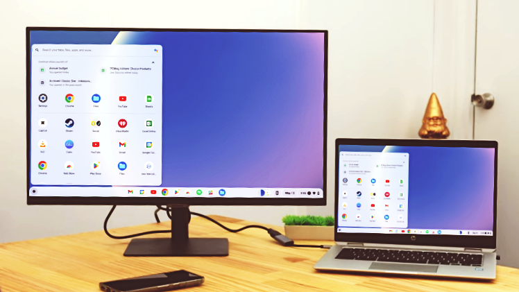

# Project 01: Linux Around Me

## 📝 Objective

In this project, I mapped where Linux shows up in the devices and services I use every day. This project captures my investigation and observations for **Chapter 1: How We Use Linux Every Day**, and it connects course concepts to examples around me.

**Related reading:** [Chapter 2: Understanding the Operating System](https://github.com/anup-moitra/foundational-linux-training/blob/main/01-understanding-linux-concepts/02-understanding-the-os.md)

## 📋 Devices and Services I Identified

Here are the devices and services I personally use that rely on Linux:

- **Phone:** Android smartphone: runs on the Linux kernel.
- **Home Wi‑Fi Router:** Linksys WRT3200ACM: runs on OpenWrt and a Linux-based firmware.
- **Smart TV:** Xiaomi MiTV AXFR0: runs on Android TV OS, which is based on the Linux kernel.
- **Tablet or eReader:** Amazon Kindle 11th Gen: runs on a customized Linux-based operating system.
- **Cloud apps I rely on:** YouTube, Gmail, Dropbox: widely known to use Linux-based infrastructure.
- **Extended setup (DIY smart display):** I repurposed an old laptop with Chromium OS (the open-source base for Chrome OS, which is Linux-based) and connected it to my TV via HDMI. This turned the TV into a Linux-powered display even though the TV itself does not run Linux natively.

## 📸 Proof: My Images and Screenshots

Below are the photos and screenshots I took as evidence. Store these under a folder named `images/` in the project directory.

### 1. My Android Smartphone

  
Snapshot showing my phone About screen with the Android version and Linux kernel information. In my case it indicated kernel version 4.14.186, which is common in several Android releases.

### 2. My Home Wi‑Fi Router

  
Screenshot of the router admin panel confirming OpenWrt 23.05.3 on Linux kernel 5.15.150.

### 3. My Smart TV

  
Settings screen showing Android TV OS version 11. Android uses the Linux kernel, and this set reported kernel version 5.4.125.

### 4. My Kindle eReader

  
Snapshot of the Kindle 11th Gen device information screen. Kindles run a customized operating system built on the Linux kernel.

### 5. My DIY Smart Display Setup

  
I installed Chromium OS on an old laptop. By connecting it to the TV via HDMI, I created a Linux-powered smart display for browsing, streaming, and cloud access.

## 🔗 Research Highlights

During this project, I looked up official sources to confirm Linux use:

- **Android:** Android is built on the Linux kernel. See the official architecture overview: <https://source.android.com/docs/core/architecture/kernel>
- **Routers:** Many consumer routers run OpenWrt, which is Linux-based: <https://openwrt.org/>
- **Smart TV:** Android TV OS uses the Linux kernel as its foundation.
- **Kindle:** Amazon Kindle eReaders use a customized Linux-based operating system.
- **Chromium OS:** Chromium OS is the open-source base for Chrome OS, both built on the Linux kernel and designed for lightweight, browser-focused systems.

## 💡 What I Learned

Linux shows up in more places than I expected. I found it in my phone, router, Kindle, and TV platform, and I extended its reach at home by installing Chromium OS on old hardware. Doing this audit helped connect course theory with everyday tech.

> “It is fascinating how many devices rely on Linux even when I do not see it directly.”

## 📁 My Process

1. I listed the devices and services I use daily.  
2. I checked About screens, admin panels, and vendor documentation for Linux references.  
3. I took photos and screenshots as proof.  
4. I built a small experiment by repurposing old hardware to extend Linux usage at home.  
5. I summarized the findings, references, and reflections here.

---

By: Anup Moitra  
Location: Bhiwadi, Rajasthan
