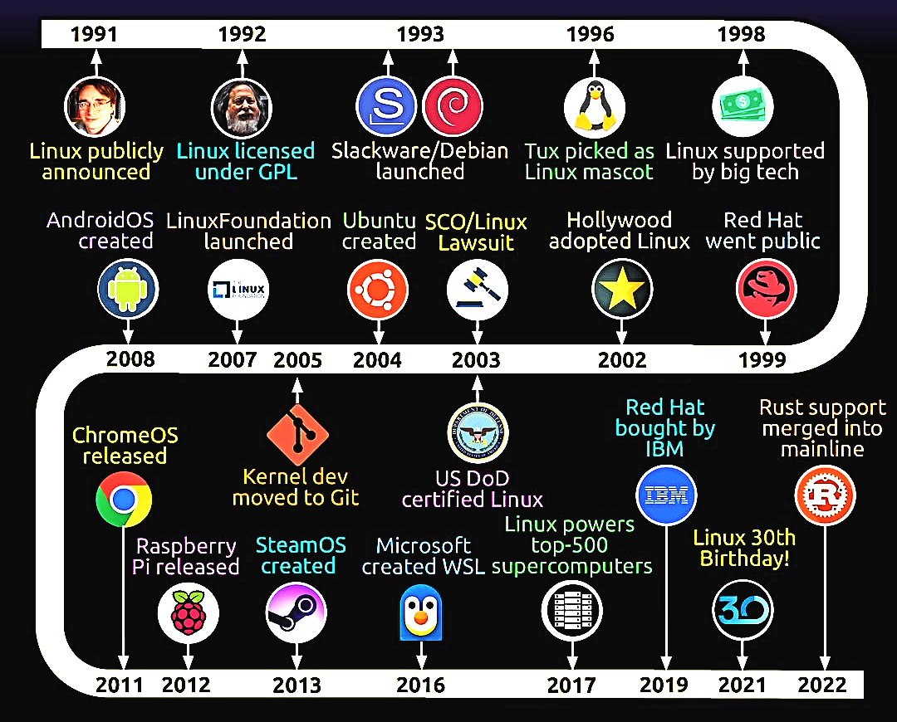

# Project 04: Linux Timeline Research  

## 📝 Objective  

In this project, I traced Linux history by researching key milestones and why they mattered. This project supports **Chapter 4: History of Linux** by showing how Linux grew from a student project into today’s global platform.  

**Related reading:** [Chapter 4: History of Linux](../01-understanding-linux-concepts/04-history-of-linux.md)  

## 📋 Tasks I Performed  

- Researched important milestones in Linux history  
- Built a simple timeline of at least five events  
- Added short notes on why each milestone mattered  

## 📸 Proof: My Images and Screenshots  

Below are the images and screenshots stored under the `images/` folder in the project directory.  

1. Timeline Diagram  
     
   *Figure 1: Infographic summarizing key milestones from UNIX roots to Android.*  

2. GNU Project Announcement  
     
   *Figure 2: GNU Project announcement posted on September 27, 1983.*  
   Source: <https://www.gnu.org/gnu/initial-announcement.html>  

3. Linux 1.0 Release  
     
   *Figure 3: Archive text announcing Linux kernel release 1.0 in 1994.*  
   Source: <https://kernel.googlesource.com/pub/scm/linux/kernel/git/nico/archive/%2B/v1.0>  

4. Linux Foundation Founded  
     
   *Figure 4: Linux Foundation was founded in 2007 to coordinate kernel development.*  
   Source: <https://www.linuxfoundation.org/press/press-release/ricoh-joins-linux-foundation>  

5. First Android Phone  
     
   *Figure 5: Confirmation of the first Android phone shipping in 2008.*  
   Source: <https://en.wikipedia.org/wiki/HTC_Dream>  

## 🔗 Research Highlights  

| **Year / Period** | **Milestone** |  
|------------------:|:--------------|  
| 1970s | **UNIX origins** – Multi-user design and rewritten in C for portability |  
| 1983 | **GNU Project** – Free software tools such as GCC, Bash, and coreutils |  
| 1991 | **Linux kernel** – Linus Torvalds begins his personal project |  
| 1992 | **GPLv2 license** – Licensing enables global collaboration |  
| 1993 | **Debian and Slackware** – Early distributions that helped adoption |  
| 1994 | **Linux 1.0 release** – First stable kernel with about 176,000 lines of code |  
| 2005 | **Git created** – Distributed version control that scaled kernel development |  
| 2007 | **Linux Foundation formed** – Coordinated development and industry support |  
| 2008 | **Android phone ships** – Linux reaches billions of users |  

## 💡 What I Learned  

- Linux success combines UNIX design principles, GNU tools, and open licensing  
- Key milestones such as GPL licensing and the creation of Git shaped not only Linux but also the broader software industry  
- Building this timeline made me appreciate the culture of collaboration and how open source principles turned Linux into a global standard  
- These historical insights are often discussed in interviews, especially around open source development and version control systems such as Git  

## 📁 My Process  

1. Reviewed Chapter 4 content  
2. Collected dates and milestones from trusted sources  
3. Created a timeline with at least five key events  
4. Added notes explaining why each milestone mattered  
5. Summarized findings and reflections here  

### 🏁 Conclusion  

By building this timeline, I saw how design ideas, licensing, and collaboration intersected to make Linux the foundation of modern computing. It also showed me how a community driven project could scale into global infrastructure.  

> 💡 **Next Up:**  
> I will explore the differences between Unix and Linux to better understand their relationship and terminology.  

---  

By: Anup Moitra  
Location: Bhiwadi, Rajasthan (India)  
