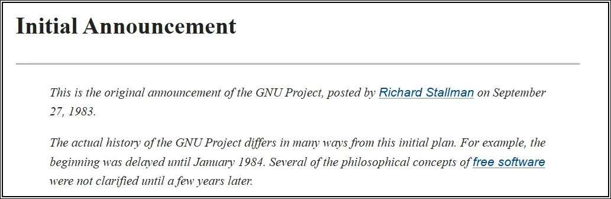
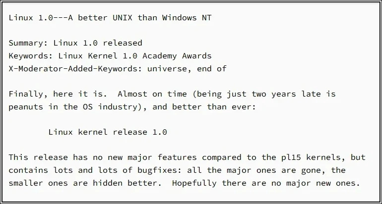
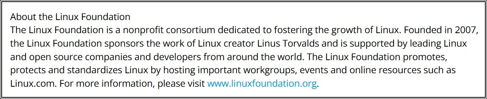

# Project 04: Linux Timeline Research

## 📝 Objective  

As part of my foundational Linux learning journey, I researched the history of Linux to connect theory with key milestones. This project supports **Chapter 4: History of Linux** by encouraging me to trace how Linux grew from a student project into today’s global platform.  

**Related reading:** [Chapter 4: History of Linux](https://github.com/anup-moitra/foundational-linux-training/blob/main/01-understanding-linux-concepts/04-history-of-linux.md)  

## 📋 Tasks I Performed  

- Researched important milestones in Linux history.  
- Built a simple timeline of at least five events.  
- Added short notes on why each milestone mattered.  

## 📸 Proof: My Images and Screenshots  

Screenshots or notes are stored under `images/` in the project directory:  

1. Timeline diagram  

   

    *Infographic summarizing key milestones from UNIX roots to Android.*
   
       
2. Notes or screenshots from official sources (kernel.org, gnu.org, linuxfoundation.org)

   
   
   *GNU Project announcement posted on September 27, 1983.*  
   Source: https://www.gnu.org/gnu/initial-announcement.html

    
   &nbsp;

   
   
   *Archive text announcing Linux kernel release 1.0 in 1994.*  
   Source: https://kernel.googlesource.com/pub/scm/linux/kernel/git/nico/archive/%2B/v1.0

    
   &nbsp;

   
   
   *About section noting the Linux Foundation was founded in 2007.*  
   Source: https://www.linuxfoundation.org/press/press-release/ricoh-joins-linux-foundation

    
   &nbsp;

   
   
   *Confirmation of the first Android phone shipping in 2008.*  
   Source: https://en.wikipedia.org/wiki/HTC_Dream

## 🔗 Research Highlights  

- **1970s: UNIX origins**. Multi-user design and rewritten in C for portability.  
- **1983: GNU Project**. Free software tools such as GCC, Bash, and coreutils.  
- **1991: Linux kernel**. Linus Torvalds begins his hobby project.  
- **1992: GPLv2 license**. Licensing enables global collaboration.  
- **1993: Debian and Slackware**. Early distributions that helped adoption.  
- **1994: Linux 1.0 release**. First stable kernel.  
- **2005: Git created**. Distributed version control that scaled kernel work.  
- **2007: Linux Foundation formed**. Coordinated development and industry support.  
- **2008: Android phone ships**. Linux reaches billions of users.  

## 💡 What I Learned  

- Linux success combines **UNIX design principles, GNU tools, and open licensing**.  
- Key milestones such as GPL licensing and the creation of Git shaped not only Linux but the broader software industry.  
- Understanding Linux history explains the culture of collaboration and why open source is powerful.  

## 📁 My Process  

1. Reviewed Chapter 4 content.  
2. Collected dates and milestones from trusted sources.  
3. Created a timeline with at least five key events.  
4. Added notes explaining each milestone.  
5. Summarized findings and reflections here.  

---  

By: Anup Moitra  
Location: Bhiwadi, Rajasthan
